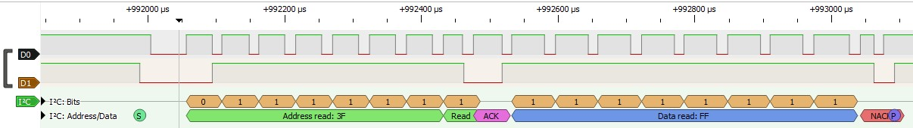

# I2C Driver Example for SC407 Device
This program is written for Turbo Pascal 3 for CP/M. It is a simple and rudimentary implementation of an I2C bus master driver, using bit-banging to the I2C port.
The slave device is an SC407 digital I/O board. Check https://smallcomputercentral.wordpress.com/ for more info on the boards.

# Environments
The driver program runs on the SC140 as well as the SC126 main board (both use an 18 MHz Z180 CPU). The SC126 contains an I2C port on the main board; the SC140 works with an SC144 I2C bus master and RTC board.
Both setups were tested with an SC407 board which is an I2C slave device with digital I/O through buttons and LEDs.

# Usage
Load the SC407.PAS-file into Turbo Pascal and just run it. It automatically includes the I2CLIB.PAS file.
You can include I2CLIB.PAS if you want to create another program using I2C.

The test program starts by reading the buttons 8 times, which is just enough to test press all buttons. Hold down one button on the SC407 and then press ENTER. Repeat.
Note that the buttons read 0 (low) when pressed, otherwise 1 (high).
After the test reads, the program writes a counter 0..255 to the LEDs. It is fast, so you mostly see flicker. You can modify the program and insert a small delay in the counter loop.

There is no real error handling, the ACK/NACK response is read but not used.

# Speed
The program was measured using a simple USB logic analyzer and PulseView. The timing diagram indicate that the speed is about 15 KHz (max I2C speed in "standard" mode is 100 KHz).
If you want higher performance you should probably implement the driver in Z80/Z180 assembler. Also, some optimizations to the Pascal code are possible, but
the structure right now is for a more readable program, easier to learn from (hopefully), and understand the details of I2C.

# Timing Diagram
This is a recording/sample of the bus on the SC407, while reading the buttons and no button is pressed (0xFF). A cheap USB logic analyzer and PulseView was used to sample the bus.

From the diagram, you can notice that the "pulses" of the SDC clock line is not exactly regular - due to the software bit-banging, there is a variance in the timing. 

